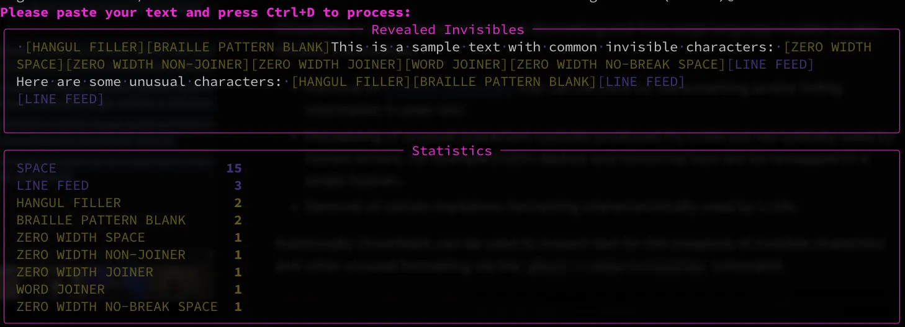

# GhostMark

**I'm in the process of setting up this repository, please be patient - I should have everything tied up by the end of the week (5/23/2025).**

---

GhostMark is a tool designed for post-formatting text from large language models (LLMs). Broadly this involves:

* Removal of [invisible characters](https://invisible-characters.com/) that can be used for warermarking and/or hiding information in plain text.
* Remapping of unusual characters typically produced my LLMs but not typically used by human writers, for example En/Em dashes and horizontal bars are be remapped to a single hyphen.
* Removal of certain markdown formatting characteristically used by LLMs.

Additionally GhostMark can be used to inspect text for the presence of invisible characters and other unusual formatting via the ``ghost --show-invisibles`` command:



Coming soon will be an MCP version that will expose GhostMark as a callable tool for agent-driven post-formatting.

## Setup

Ahead of getting this project up and running you can run locally via the commands below.

First, clone this repository:

```shell
git clone https://github.com/theobjectivedad/ghostmark.git
```

Change directory to the cloned repository:

```shell
cd ghostmark
```

Next, create a virtual environment. Note that ``uv`` will be installed if it isn't found in the environment:

```shell
make venv
```

Now install into the virtual environment:

```shell
uv pip install --user --editable .
```

Finally, create an alias for the script in the newly created virtual environment, this can be in ``~/.bashrc``, ``~/.zshrc``, etc. depending on your shell:

```shell
alias ghost=PATH_TO_GOSTMARK/.venv/bin/ghost
```

You can now use GhostMark via the CLI:

```shell
ghost 
```

Access CLI help via:

```shell
ghost --help
```
